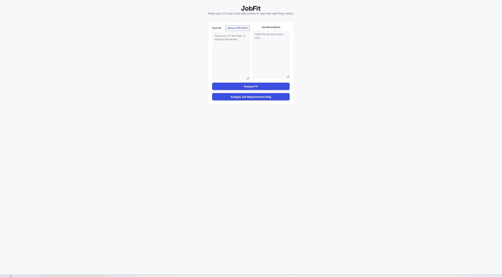
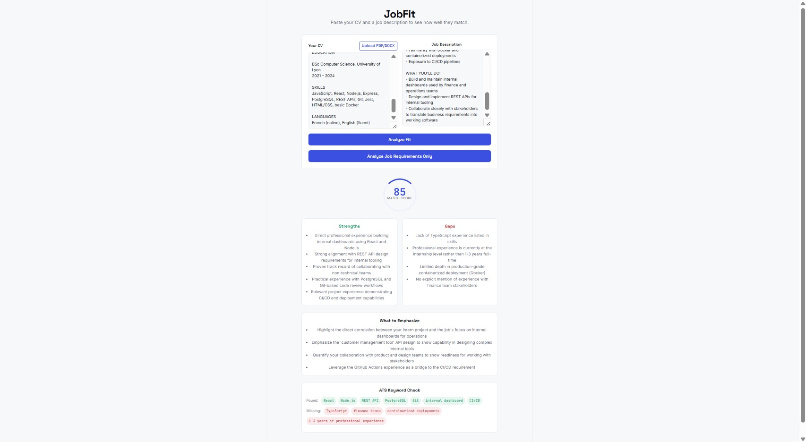

# JobFit

An AI-powered job-fit matcher that analyzes how well a CV matches a job description — instantly identifying strengths, gaps, and exactly what to emphasize.

🔗 **[Live Demo](https://jobfit-kappa.vercel.app)**



## Features

- **CV/Job Match Analysis** — paste a CV and job description, get a match score (0–100), specific strengths, gaps, and tailored advice on what to emphasize
- **ATS Keyword Checker** — see exactly which keywords from the job description are present or missing in the CV, mirroring how real Applicant Tracking Systems scan resumes
- **Bullet Point Rewrites** — get 2–3 of the weakest CV bullets rewritten to better match the job's language, without fabricating skills or experience
- **Job Requirements Analysis** — paste just a job description (no CV needed) to get essential vs. preferred skills, inferred experience level, and CV structuring suggestions
- **File Upload** — upload a CV as PDF or DOCX; text is extracted automatically and stays editable before analysis

## Tech Stack

**Frontend:** React (Vite), plain CSS with a custom design system
**Backend:** Node.js, Express
**LLM:** Google Gemini (via a provider abstraction — Anthropic Claude is also supported and can be swapped in via one environment variable)
**File parsing:** `unpdf` (PDF text extraction), `mammoth` (DOCX text extraction)
**Deployment:** Frontend on Vercel, backend on Render

## How It Works

- The LLM API key never touches the frontend — all AI calls go through the Express backend
- User-submitted CV/job text is wrapped in tagged sections in the prompt, with explicit instructions to treat that content as data only, never as instructions — a defense against prompt injection
- File uploads are validated by actual file content type, not filename extension
- Input length is capped to prevent abuse
- The LLM integration is built behind a provider abstraction, so switching between Claude and Gemini is a one-file change



## Setup

### Prerequisites
- Node.js 18+
- A Google Gemini API key ([get one here](https://aistudio.google.com/apikey))

### Backend

\```bash
cd backend
npm install
cp .env.example .env
# Add your GEMINI_API_KEY to .env
npm start
\```

### Frontend

\```bash
cd frontend
npm install
npm run dev
\```

The app will be available at `http://localhost:5173`, connecting to the backend at `http://localhost:5000`.

## License

MIT